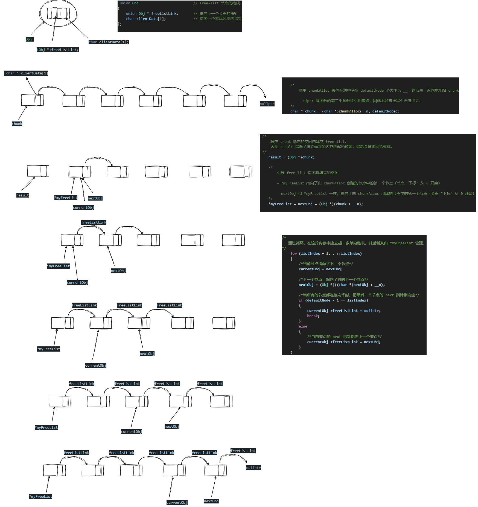

# 侯捷《STL 源码分析》学习笔记，目前已经学习至：2.2.9 重新填充 free-lists

## reFill() 函数的运行过程图解

Author: [JesseZ332623](https://github.com/JesseZ332623)

LICENCE: [MIT LICENCE](https://opensource.org/license/mit/)

Latest Update: 2024.1.26
