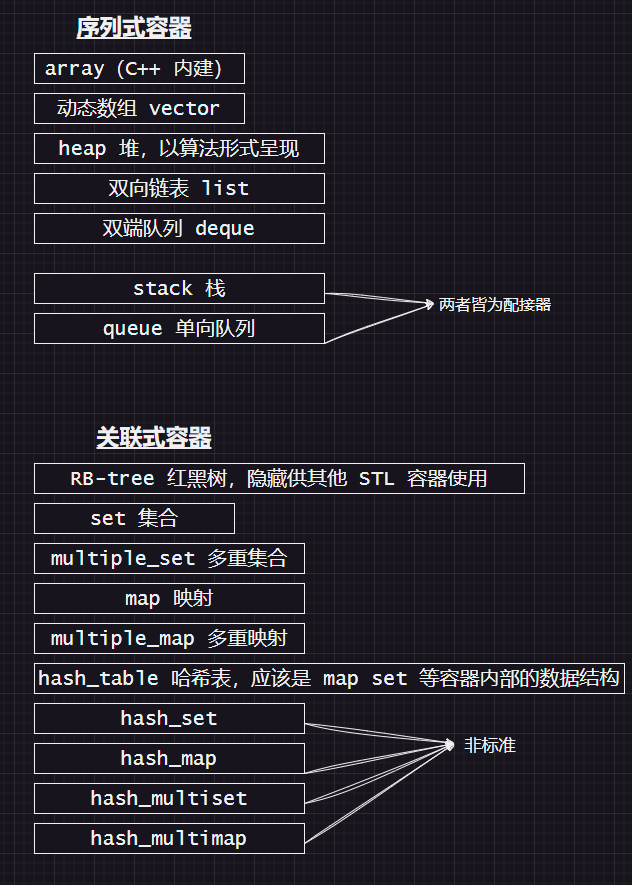

# 章节 4：序列式容器

## STL 常用的数据结构无非就几种

- array             数组
- vector            动态数组
- list              双向链表
- forward_list      单向链表
- stack             栈
- queue             队列
- set               集合
- map               映射
- hash_table        散列表

这些数据结构分为序列式和关联式，本章要讨论的是序列容器。

## 容器之间的关系如下图所示

